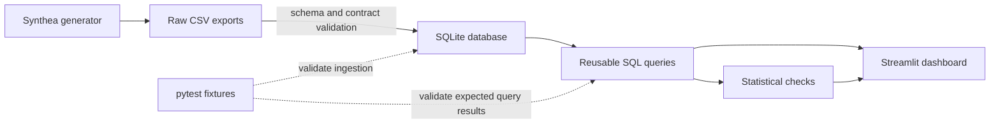

# Patient Pathway Analysis

[](https://github.com/juliettebm/patient-pathway-analysis/actions/workflows/ci.yml)


End-to-end SQL, statistics and Streamlit demonstrator built from
[Synthea](https://synthea.mitre.org/) synthetic health records.

> [!IMPORTANT]
> This repository demonstrates a data pipeline; it does **not** demonstrate
> clinical performance. The cohort contains no real patients. Associations and
> very small p-values reflect the Synthea generation mechanism, the selected
> sample and its size. They are neither clinical discoveries nor evidence that
> the effects generalise to a real population.

## What this project validates

The statistical analyses are positive-control checks: they verify that ingestion,
SQL grouping and statistical code recover patterns present in the generated data.
For example, the previously reported obesity result (`p = 8.55e-26`) should be read
as “the pipeline detects this simulator-dependent pattern”, not “obesity has a
newly discovered clinical effect”. No causal or external-validity claim is made.

## Pipeline



The executable ingestion lives in `src/pipeline.py`; canonical queries live in
`src/queries.py`. The notebooks remain exploratory presentations, while these
modules are the tested source of truth.

## Reproduce

```bash
git clone https://github.com/juliettebm/patient-pathway-analysis.git
cd patient-pathway-analysis
python -m pip install -r requirements.txt
```

Generate Synthea CSV output and place `patients.csv`, `encounters.csv`,
`conditions.csv` and `procedures.csv` in `data/raw/`, then run:

```bash
python scripts/build_database.py
pytest -q
python scripts/verify_results.py
streamlit run streamlit_app/app.py
```

The loader validates required Synthea columns, creates stable identifiers for
condition and procedure rows, preserves SQLite primary/foreign-key constraints,
checks referential integrity, and only replaces the target database after a
successful build.

## Test coverage

The tests use a small deterministic synthetic fixture and cover:

- the generator-export contract (required files and columns);
- case-insensitive Synthea headers and derived deceased status;
- stable unique row identifiers;
- row loading, primary keys and foreign-key enforcement;
- zero-encounter patients retained by `LEFT JOIN`;
- distinct chronic-disease-group counting (several labels of one disease count once);
- mutually exclusive obesity comparison groups;
- exclusion of non-chronic labels and single counting of multi-label diseases;
- threshold sensitivity output;
- Streamlit pages (landing, Overview, Pathways, Patient Explorer, Statistics)
  executing against a SQLite fixture.

These are software and data-contract tests. They do not validate Synthea as a
model of clinical reality.

CI runs the deterministic fixture tests and syntax smoke test on Python 3.12.10
with exact dependency versions. Because the full Synthea export is intentionally
not committed, full-cohort reproducibility is reported separately: after building
the database, `scripts/verify_results.py` compares canonical calculations with
`results/reference_metrics.json` and fails on unexplained drift. The snapshot is a
software-regression reference, not a clinical benchmark.

## Database and data dictionary

| Table | Grain | Primary key | Description |
|---|---|---|---|
| `patients` | one row per synthetic person | `patient_id` | Demographics and vital status |
| `encounters` | one row per generated visit | `encounter_id` | Dated healthcare encounters |
| `conditions` | one condition occurrence | `condition_id` | Generated diagnoses/findings |
| `procedures` | one procedure occurrence | `procedure_id` | Generated clinical procedures |

See the complete field-level [data dictionary](docs/data_dictionary.md).

## Analyses

- SQL cohort KPIs, visit counts, multimorbidity and pathway chronology;
- Fisher exact check of gender and multimorbidity (2+ distinct chronic-disease groups);
- descriptive Mann-Whitney comparison by generated obesity status;
- Welch comparison across generated age groups;
- descriptive OLS diagnostic retained for teaching, not as a primary count model;
- exploratory negative-binomial GLM with age, encounter-window exposure and death
  status, plus Holm correction across four prespecified checks.

Multimorbidity is defined as at least 2 distinct chronic-disease groups, the usual
literature threshold. Raw Synthea labels are not counted: they mix diagnoses with
social, administrative and acute entries, and one disease can carry several labels.
Each label is mapped to a chronic group in `CHRONIC_CONDITION_GROUPS`
(`src/queries.py`); the list was fixed from label names before any outcome was
examined and has **not** been reviewed by a clinician. A previous definition (5+ raw
labels) classified 90% of the cohort as high burden and separated almost nothing.
On the reference export 667 of 1,146 patients (58.2%) are multimorbid (F 343/563,
M 324/583). Fisher's exact test is the primary gender comparison (p = 0.072, OR 1.25:
not significant at 5%; chi-square agrees). The result depends on the threshold
(p = 0.015 at 1+, 0.59 at 3+), which the Pathways page shows. The
Mann-Whitney result is unadjusted and the patients are not matched, so it is never
presented as an obesity effect. Statistical significance is not clinical importance.

## Project layout

```text
data/raw/                 Synthea CSV exports (not tracked)
database/                 generated SQLite database (not tracked)
docs/data_dictionary.md   field definitions and provenance
notebooks/                exploratory SQL and statistical walkthroughs
scripts/build_database.py reproducible ingestion command
scripts/verify_results.py full-cohort result-drift check
src/pipeline.py            validation and SQLite build
src/queries.py             canonical parameterised SQL
src/analysis.py            canonical statistical calculations
streamlit_app/             interactive presentation
tests/                     deterministic pipeline and SQL tests
results/                   versioned software-regression snapshot
```

## Limitations

- Synthetic-data results do not establish real-world performance or validity.
- Synthea's rules can directly or indirectly encode the detected associations.
- P-values shrink with sample size and do not measure effect importance.
- Encounter counts depend on age, available follow-up and death. The exploratory
  adjustment cannot eliminate residual confounding or generator bias.
- OLS assumptions do not suit skewed count outcomes; its output is diagnostic only.
- The obesity comparison is not matched and does not establish causality.
- Multiple-testing p-values are reported with a Holm adjustment.
- The dashboard is educational and is not a medical device or decision aid.
- Real evaluation would require an independently governed clinical dataset,
  prespecified endpoints, bias assessment and external validation.

## Data source and licence

Walonoski, J., et al. (2017). *Synthea: An approach, method, and software
mechanism for generating synthetic patients and the synthetic electronic health
care record.* Journal of the American Medical Informatics Association.

Code is released under the [MIT License](LICENSE). No real patient information is
included in this repository.
